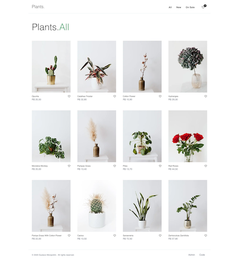
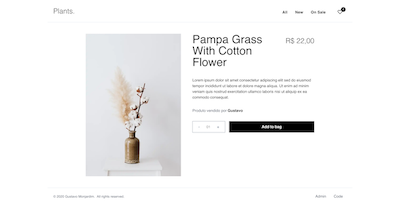
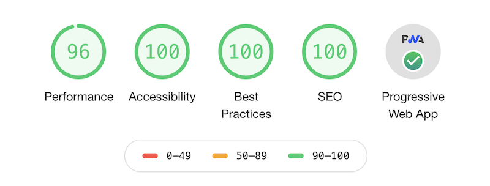

# Plants Ecommerce

[](https://codecov.io/gh/gustavomonjardim/ecommerce)

[](https://app.netlify.com/sites/plantstore/deploys)
[](https://lbesson.mit-license.org/)

Available on [https://plantstore.netlify.com/](https://plantstore.netlify.com/)


This project is an Ecommerce application built with Gatsby, React, Tailwind, Netlify, Netlify CMS and pagarme-js

It follows the JAMstack architecture by using Git as a single source of truth, and Netlify for continuous deployment and CDN distribution.






## Prerequisites

- [Node](https://nodejs.org/en/)
- [yarn](https://classic.yarnpkg.com/)

## Getting started

### Deploying to Netlify

Use the button below to build and deploy your own copy of this repository to Netlify:

<a href="https://app.netlify.com/start/deploy?repository=https://github.com/gustavomonjardim/ecommerce&amp;stack=cms"></a>

After clicking that button, you’ll authenticate with GitHub and choose a repository name. Netlify will then automatically create a copy of this repository in your GitHub account. Next, it will build and deploy the new site on Netlify.

### Running the project locally

1. Clone the project

```shell
$ git clone https://github.com/gustavomonjardim/ecommerce.git
```

2. Install the dependencies:

```shell
$ yarn
```

3. Run the project

```shell
$ yarn start
```

4. Generating a production build

```shell
$ yarn build
```

## Technologies

- Built with [Gatsby](https://github.com/gatsbyjs/gatsby) and [React](https://github.com/facebook/react).
- Uses [Tailwind CSS](https://tailwindcss.com/) for styling, but size is reduced by `purge-css-plugin`.
- Uses [Netlify](https://www.netlify.com/) for continuous deployment and CDN distribution.
- [Netlify CMS](https://github.com/netlify/netlify-cms) for content management.
- Payments are processed with [pagarme-js](https://github.com/pagarme/pagarme-js).
- Uses [Formik](https://github.com/jaredpalmer/formik) and [Yup](https://github.com/jquense/yup) for building and validating forms.


## Project structure

```
/src
|-- /assets
    |-- /fonts
    |-- /images
    |-- /svg
|-- /cms
|-- /components
|-- /content
    |-- products
    |-- sellers
|-- /context
|-- /forms
|-- /functions
|-- /hooks
|-- /layouts
|-- /pages
|-- /services
|-- /styles
|-- /templates
```

- **`/assets`**: Images, fonts and icons are stored in this folder.
- **`/cms`**: This folder contains the Netlify CMS configuration for registering preview templates.
- **`/components`**: Contains reusables components used throughout the whole application.
- **`/content`**: Content uploaded from the CMS is stored in this folder.
- **`/context`**: Providers and consumers built with the [React Context API](https://reactjs.org/docs/context.html) are stored in this folder.
- **`/forms`**: This folder contains all the forms used in the checkout page.
- **`/functions`**: This folder hosts all [Netlify lambda functions](https://docs.netlify.com/functions/overview/).
- **`/hooks`**: Custom [React hooks](https://reactjs.org/docs/hooks-custom.html) are stored in this folder.
- **`/layouts`**: Components responsible for managing common page elements, such as markup, styles, and functionality across multiple pages. Learn more [here](https://www.gatsbyjs.org/docs/recipes/pages-layouts/).
- **`/pages`**: Components under src/pages become pages automatically with paths based on their file name.
- **`/services`**: This folder hosts services and funcionalities used throughout the application.
- **`/styles`**: Global styles are stored in this folder.
- **`/templates`**: Contains templates for programmatically creating pages.


To learn more about Gatsby project structure, check out the documentation [here](https://www.gatsbyjs.org/docs/gatsby-project-structure/).

## Environment Variables

This project expects the following environment variables:

- **`PAGARME_API_KEY`**: API Key used to access pagarme-js endpoints.
- **`PLATFORM_ID`**: `recipient_id` of the marketplace owner. Learn more about recipients [here](https://docs.pagar.me/docs/criando-um-recebedor-1).
- **`PLATFORM_PERCENTAGE`**: Integer number that represents the percentage of the transaction value attributed to the marketplace owner.
- **`SELLER_PERCENTAGE`**: Integer number that represents the percentage of the transaction value attributed to the seller of the product.

To learn more about split rules with pagarme-js, check out the documentation [here](https://docs.pagar.me/docs/split-rules).


## Netlify CMS

This project uses [Netlify CMS](https://www.netlifycms.org/) for content management. Netlify CMS provide a friendly UI where you can upload new content directly to your Git repository. You can learn how to integrate it with a Gatsby project in this [Quick Start Guide](https://www.netlifycms.org/docs/gatsby/).

Alternatively, if you want to add content to this project without having to setup Netlify CMS, you can add or edit files inside the `content` folder described in the [Project structure](#project-structure) session.

## Testing

You can run tests with the following command:

```shell
$ yarn test
```

## License

Licensed under the [MIT License](./LICENSE).

